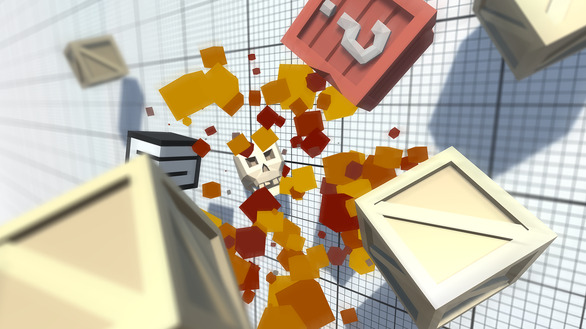

# Unit5

Task-https://learn.unity.com/project/unit-5-user-interface?language=en&missionId=5f7648a4edbc2a5578eb67df&pathwayId=5f7e17e1edbc2a5ec21a20af&contentId=5f7649a0edbc2a2315d471f7

This module is programmed with a game to test the player's reflexes, the purpose of which is to click and destroy objects that are accidentally thrown into the air before they can fall off the screen. While creating this prototype, it was learned how to implement the user interface - or UI - in projects. Added a title screen with a difficulty selection menu that will control how difficult the gameplay is, added a score display that will track how many points the player has earned, and an end screen that will allow you to restart the player and try again.

